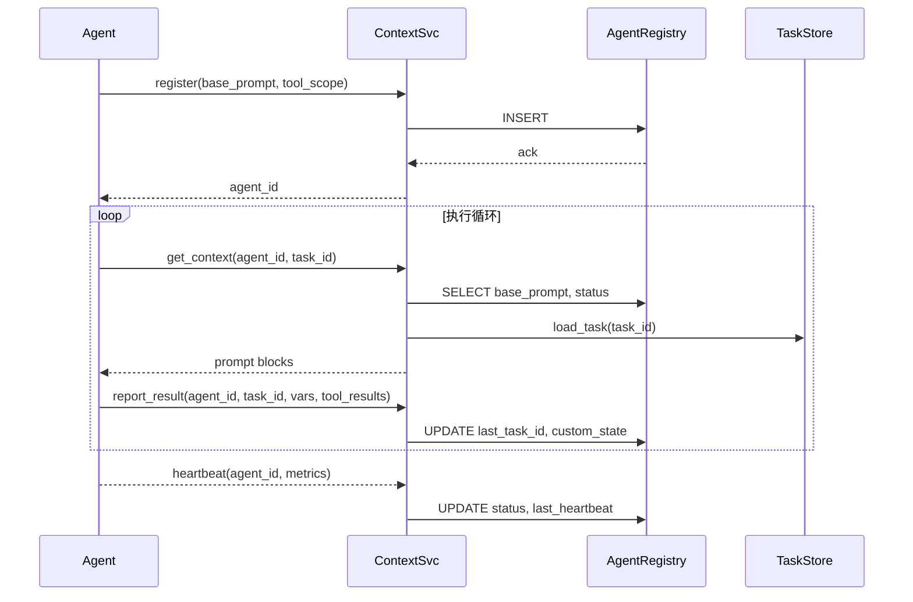

# Agent Registry 设计

## 1. 背景
在 “Context Service + 分布式 Agent” 架构下，需要集中管理每个 Agent 的身份信息、默认 Prompt、权限与运行状态。本设计文档描述了 Agent Registry 的表结构、核心 API 以及运行时交互流程。

## 2. 数据模型
| 字段 | 类型 | 说明 |
|------|------|------|
| `agent_id` | UUID (PK) | 全局唯一 ID |
| `name` | string | 业务友好名称 |
| `role` | string | 能力标签，如 complaint_handler |
| `base_prompt` | text | 固有 SYSTEM 段 |
| `default_env` | JSONB | 启动时固定环境变量 |
| `tool_scope` | JSONB | 可调用工具白名单 |
| `status` | enum | online / offline / degraded |
| `last_heartbeat` | timestamp | 最后心跳时间 |
| `last_task_id` | string | 最近执行任务 |
| `custom_state` | JSONB | 运行期自定义 KV |
| `knowledge_config` | JSONB | Agent 所依赖的知识库 |

> **索引**：`status`, `last_heartbeat`，便于监控。

## 3. 核心 API
| Method | Path | 描述 |
|--------|------|------|
| POST | `/agents/register` | Agent 注册，返回 `agent_id` |
| POST | `/agents/heartbeat` | 定时心跳，更新状态 & 指标 |
| GET | `/context` | 拉取 Prompt 上下文，参数：`agent_id`, `task_id`, `globals` |
| POST | `/report` | 上报执行结果 & 变量更新 |
| GET | `/agents/:id` | 查看 Agent 信息 |
| GET | `/agents` | 列表 & 过滤 |

## 4. 运行时交互时序图


## 5. 权限与安全
- **ToolScope 白名单**：确保 Agent 仅能调用授权工具。
- **API Token**：注册时颁发 JWT/Token，后续请求需携带。
- **速率限制**：基于 `agent_id` 做 QPS 控制。

## 6. 可观测性
- **Metrics**：每次 heartbeat 上报 CPU、内存、token 消耗。
- **Logs**：Context Service 记录 prompt、响应、工具结果。
- **Alerts**：`last_heartbeat` 超时 & `status=degraded` 触发报警。

## 7. 进阶特性
- **灰度升级**：新增 `base_prompt_version` 字段；ContextSvc 根据版本推送更新。
- **多租户隔离**：在表中加入 `tenant_id`，实现跨业务隔离。 

## 8. 数据库配置与自动查询
### 8.1 registry 字段示例
```json
"database_config": {
  "db_type": "postgres",
  "config_id": "crm_pg_prod",    // 在 Secret Manager 中的引用
  "readonly": true,
  "max_rows": 200
}
```
- `db_type`：`postgres` / `mysql` / `sqlite` / `mongodb` 等。
- `config_id`：指向 Secret Manager 或 Vault 中的凭证条目。
- `readonly`：若为 true，Context Service 仅允许查询，不执行 DML。
- `max_rows`：对单次查询加行数上限，防爆内存。

### 8.2 Context Service 自动查询流程
1. **解析 SQL 需求**  
   - Agent 在 LLM 输出中返回 `{ "sql": "SELECT ..." }` 或 `{"db_query": {...}}`。  
   - Context Service 校验语句（如 whitelist 表、关键字）。
2. **凭证获取**  
   - 根据 `database_config.config_id` 从 Secret Manager 拉取连接串。
3. **执行**  
   - 通过数据库连接池执行，只读模式下拒绝非 `SELECT`。
4. **结果压缩**  
   - 超出 `max_rows` 或字段过多时自动分页或摘要。
5. **回写**  
   - 查询结果写入 ResultStore，并可在下一步 Prompt 的 `CONTEXT_DATA -> db_results` 注入。

### 8.3 安全措施
- 使用最小权限账户（readonly）。
- SQL 注入检测：预编译 + 参数化占位符。
- 查询审计：查询语句与返回行数记录到日志。

### 8.4 示例 Prompt 注入
```json
"db_results": {
  "ticket_info": [
    {"ticket_id":"T20250715","status":"open","owner":"agentA"}
  ]
}
``` 