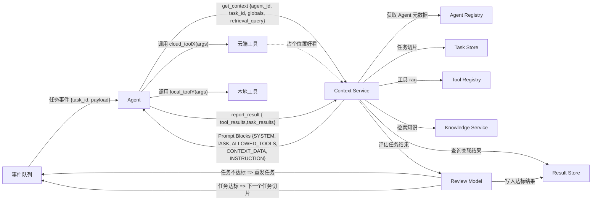
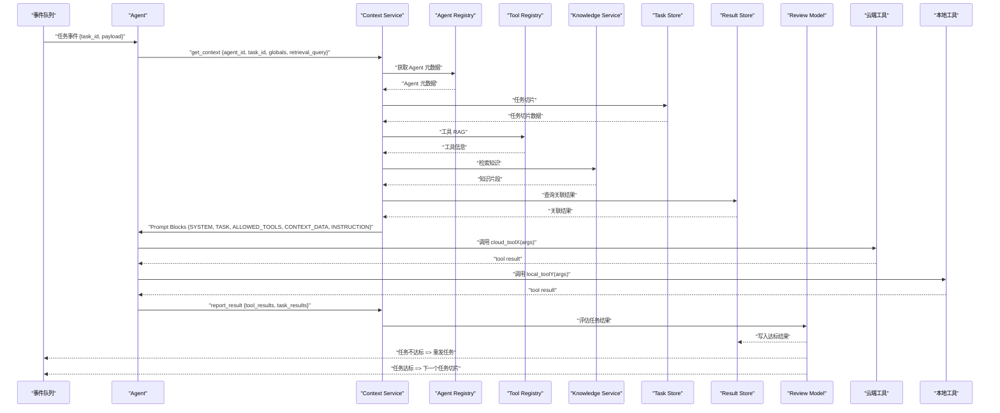

# Agent – Context Service 关系图

```mermaid
graph LR
    EQ["事件队列"]
    A["Agent"]
    CS["Context Service"]
    AR["Agent Registry"]
    TS["Task Store"]
    TR["Tool Registry"]
    KS["Knowledge Service"]
    RS["Result Store"]
    CT["云端工具"]
    LT["本地工具"]
    RM["Review Model"]

    EQ -->|"任务事件 {task_id, payload}"| A
    A -->|"get_context {agent_id, task_id, globals, retrieval_query}"| CS
    CS -->|"获取 Agent 元数据"| AR
    CS -->|"任务切片"| TS
    CS -->|"工具 rag"| TR
    CS -->|"检索知识"| KS
    CS -->|"Prompt Blocks {SYSTEM, TASK, ALLOWED_TOOLS, CONTEXT_DATA, INSTRUCTION}"| A
    A -->|"调用 cloud_toolX(args)"| CT
    A -->|"调用 local_toolY(args)"| LT
    CT -.->|"占个位置好看"| CS
    A -->|"report_result { tool_results,task_results}"| CS
    RM -->|"写入达标结果"| RS
    CS -->|"查询关联结果"| RS
    CS -->|"评估任务结果"| RM
    RM -->|"任务不达标 => 重发任务"| EQ
    RM -->|"任务达标 => 下一个任务切片"| EQ
```

## 数据流动通路时序图

```mermaid
sequenceDiagram
    participant EQ as "事件队列"
    participant Agent as "Agent"
    participant CS as "Context Service"
    participant AR as "Agent Registry"
    participant TR as "Tool Registry"
    participant KS as "Knowledge Service"
    participant TS as "Task Store"
    participant RS as "Result Store"
    participant RM as "Review Model"
    participant CT as "云端工具"
    participant LT as "本地工具"

    EQ->>Agent: "任务事件 {task_id, payload}"
    Agent->>CS: "get_context {agent_id, task_id, globals, retrieval_query}"
    CS->>AR: "获取 Agent 元数据"
    AR-->>CS: "Agent 元数据"
    CS->>TS: "任务切片"
    TS-->>CS: "任务切片数据"
    CS->>TR: "工具 RAG"
    TR-->>CS: "工具信息"
    CS->>KS: "检索知识"
    KS-->>CS: "知识片段"
    CS->>RS: "查询关联结果"
    RS-->>CS: "关联结果"
    CS->>Agent: "Prompt Blocks {SYSTEM, TASK, ALLOWED_TOOLS, CONTEXT_DATA, INSTRUCTION}"
    Agent->>CT: "调用 cloud_toolX(args)"
    CT-->>Agent: "tool result"
    Agent->>LT: "调用 local_toolY(args)"
    LT-->>Agent: "tool result"
    Agent->>CS: "report_result {tool_results, task_results}"
    CS->>RM: "评估任务结果"
    RM-->>RS: "写入达标结果"
    RM-->>EQ: "任务不达标 => 重发任务"
    RM-->>EQ: "任务达标 => 下一个任务切片"
``` 