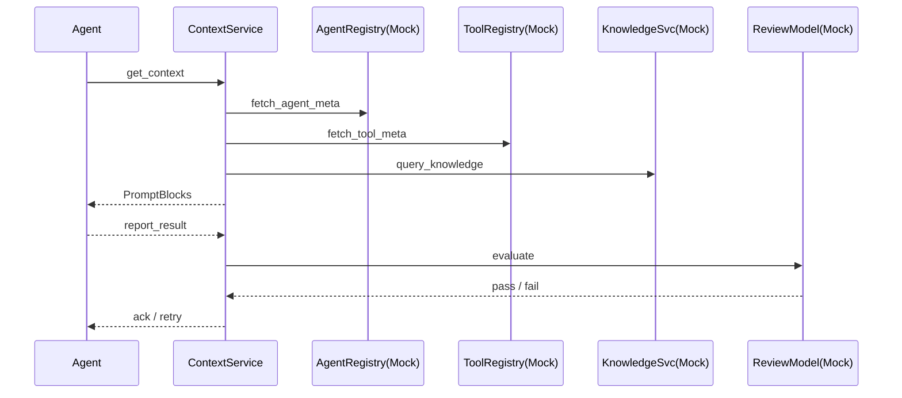

# Context Service 开发计划（核心框架）

> 目标：在 **不实现真实 Agent 与工具平台** 的前提下，通过 Mock 注入元数据，先行搭建 Context Service 主体架构，支撑后续模块渐进式完善。

---

## 1. 范围说明
1. **实现范围**：
   - Context Service 核心流程（事件 → 上下文构造 → Prompt 生成 → 结果上报 → 评估）。
   - 数据库表：`TASK STORE`、`RESULT STORE` 及关联枚举/索引（参考 `database_schema.md`）。
   - Mock 服务：Agent Registry、Tool Registry、Knowledge Service、Review Model。
   - 基础可观测性：日志、链路追踪、指标。
2. **暂不实现**：
   - 真正的 Agent SDK / 本地工具调用链。
   - 云端／本地 Tool Adapter。
   - 完整 Review Model 算法，仅返回固定通过/失败。

---

## 2. 里程碑拆解
| 序号 | 里程碑 | 关键交付物 | 依赖 |
|-----|-------|-----------|------|
| M1 | 项目初始化 & 技术选型（Python + uv） | Python 项目骨架、uv 依赖管理（国内镜像配置）、CI 流水线、基础目录结构 | 无 |
| M2 | 数据库 Schema & Migration | `schema.sql` + 自动迁移脚本 | M1 |
| M3 | Task Store & Slice 逻辑 | ORM 模型、切片 CRUD 接口 | M2 |
| M4 | Mock Registry & Service Stub | Agent/Tool/Knowledge/Review Mock 服务 | M1 |
| M5 | Context Builder Pipeline | `get_context` API、Prompt Blocks 组装 | M3、M4 |
| M6 | Result Reporting & 存储 | `report_result` API、结果写入、状态机更新 | M3 |
| M7 | 简易评估流程 | 调用 Mock Review，更新任务状态/重试 | M5、M6 |
| M8 | 可观测性 & Dashboard | 日志格式化、OpenTelemetry、Prometheus 指标 | 贯穿 |
| M9 | 集成测试 & 文档 | 流程 e2e 测试、Swagger/OpenAPI、README | M5、M6、M7 |

---

## 3. 组件模块划分
1. **api/**
   - RESTful/GraphQL 入口，提供 `get_context`, `report_result` 等端点。
2. **service/**
   - 业务核心：ContextBuilder、TaskManager、EvaluationOrchestrator。
3. **repository/**
   - 数据访问层：封装对 PostgreSQL / Redis 的操作。
4. **mock/**
   - `agent_registry_service.ts`
   - `tool_registry_service.ts`
   - `knowledge_service.ts`
   - `review_model_service.ts`
5. **observability/**
   - 日志、Tracing、中间件。

---

## 4. 关键流程示意

---

## 5. Mock 策略
- **数据来源**：固定 JSON/内存 HashMap，或读取 `fixtures/*.json`。
- **Agent 元数据**：`{id, name, base_prompt, allowed_tool_ids}`。
- **Tool 元数据**：`{id, name, execution_mode, schema}`。
- **知识片段**：返回随机两段 Lorem Ipsum。
- **评估结果**：80% 通过，20% 失败用于测试重试逻辑。

---

## 6. 测试计划
1. **单元测试**：Repository、Service 层核心逻辑。
2. **集成测试**：完整任务流（含 Mock 调用）。
3. **边界测试**：重试机制、切片超时、Mock 失败场景。

---

## 7. 风险与缓解
| 风险 | 影响 | 缓解措施 |
|------|------|----------|
| Schema 频繁变动 | 迁移复杂度 | 使用自动迁移工具，保持向后兼容 |
| Prompt 组装格式错误 | LLM 调用失败 | 编写 Prompt 单元测试 + JSON Schema 校验 |

---

## 8. 后续迭代方向
1. 替换 Mock 为真实 Agent Registry & Tool Registry API。
2. 引入 Hybrid 工具调度（cloud + agent）。
3. 强化 Review Model，接入模型评估或人工审核工作流。
4. 上线指标：任务吞吐量、平均延迟、重试率等。 