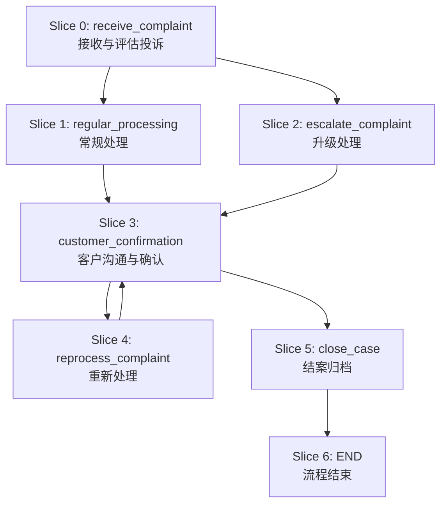

# DSL任务切片实现方案总结

## 问题回答

### 1. 切片策略选择：按@task为单位切片 ✅

经过分析，我推荐采用 **按@task为单位进行切片** 的策略，理由如下：

#### 为什么选择@task级别切片？

| 优势 | 具体体现 |
|------|---------|
| **逻辑完整性** | 每个@task代表一个完整的业务步骤，包含描述、工具调用、条件分支等 |
| **DSL自然结构** | 符合DSL的设计意图，@task是DSL的核心组织单元 |
| **便于理解和调试** | 开发者和用户都容易理解，任务级别的错误定位更直观 |
| **执行粒度适中** | 既不会过于细碎影响性能，也不会过于粗糙失去灵活性 |

#### 实际切片效果

基于 `level_2_medium_natural_llm_generated_20250715_100809.dsl` 文件，系统成功生成了 **7个任务切片**：



### 2. 用户接口设计方案

#### 2.1 文件上传接口 📁

```python
POST /api/tasks/upload-dsl
Content-Type: multipart/form-data

请求参数:
- file: DSL文件 (.dsl 格式)
- agent_id: 目标Agent的UUID
- metadata: 任务元数据 (可选)
  - description: 任务描述
  - version: 版本号
  - tags: 标签列表

响应示例:
{
  "task_id": "uuid-here",
  "status": "parsed",
  "slices_count": 7,
  "variables": ["complaint_severity", "customer_type"],
  "tools_required": ["crm_system_create", "notification_service", "satisfaction_survey", "crm_system_update"],
  "message": "DSL解析成功，任务切片已创建"
}
```

#### 2.2 文本输入接口 📝

```python
POST /api/tasks/create-from-text
Content-Type: application/json

请求体:
{
  "dsl_content": "完整的DSL文本内容...",
  "agent_id": "uuid-here",
  "metadata": {
    "description": "直接输入的DSL流程",
    "version": "1.0"
  }
}

响应格式: 与文件上传接口相同
```

#### 2.3 任务查询接口 🔍

```python
GET /api/tasks/{task_id}
Content-Type: application/json

响应:
{
  "task_id": "uuid-here",
  "agent_id": "uuid-here",
  "status": "parsed",
  "slices_count": 7,
  "variables": ["complaint_severity", "customer_type"],
  "tools_required": ["crm_system_create", "notification_service", "satisfaction_survey", "crm_system_update"],
  "created_at": "2025-01-15T10:08:09.144390",
  "metadata": {
    "description": "客户投诉处理流程",
    "version": "1.0"
  }
}
```

#### 2.4 任务切片查询接口 📋

```python
GET /api/tasks/{task_id}/slices
Content-Type: application/json

响应:
{
  "task_id": "uuid-here",
  "slices": [
    {
      "slice_id": 0,
      "task_name": "receive_complaint",
      "task_title": "接收与评估投诉",
      "description": ["使用CRM系统创建新的投诉工单", "记录客户信息、联系方式和投诉内容"],
      "tools": [{"name": "crm_system_create", "description": "创建投诉工单", "position": 1}],
      "conditions": [{
        "expression": "complaint_severity == \"高\" OR customer_type == \"VIP客户\"",
        "true_next": "escalate_complaint",
        "false_next": "regular_processing"
      }],
      "variables_used": ["complaint_severity", "customer_type"]
    }
  ]
}
```

### 3. 具体实现路径

#### 3.1 技术架构


#### 3.2 核心组件实现

| 组件 | 实现状态 | 技术选型 |
|------|---------|---------|
| **DSL解析器** | ✅ **已实现** | Python正则表达式 + 状态机 |
| **切片生成器** | ✅ **已实现** | 基于解析结果生成JSON结构 |
| **数据库存储** | ✅ **已设计** | PostgreSQL + JSONB字段 |
| **文件上传API** | 🔄 **待实现** | FastAPI + multipart/form-data |
| **查询API** | 🔄 **待实现** | FastAPI + RESTful接口 |

#### 3.3 数据库存储结构

##### 主任务表(tasks)存储:
```json
{
  "dsl_metadata": {
    "source_file": "level_2_medium_natural_llm_generated_20250715_100809.dsl",
    "generated_at": "2025-07-15T10:08:09.144390",
    "provider": "openai",
    "model": "deepseek-chat-0324"
  },
  "global_variables": {
    "complaint_severity": {"type": "string", "default": "", "description": "投诉严重等级"},
    "customer_type": {"type": "string", "default": "", "description": "客户类型"}
  },

}
```

##### 任务切片表(task_slices)存储:
```json
{
  "task_name": "receive_complaint",
  "task_title": "接收与评估投诉",
  "description": ["使用CRM系统创建新的投诉工单", "记录客户信息、联系方式和投诉内容", ...],
  "tools": [{"name": "crm_system_create", "description": "创建投诉工单", "position": 1}],
  "conditions": [{
    "expression": "complaint_severity == \"高\" OR customer_type == \"VIP客户\"",
    "true_next": "escalate_complaint",
    "false_next": "regular_processing"
  }],
  "variables_used": ["complaint_severity", "customer_type"],
  "default_next": null
}
```

### 4. 验证结果

✅ **DSL解析器测试成功**：
- 解析变量数量: 2个
- 解析任务数量: 7个  
- 生成切片数量: 7个
- 元数据提取完整
- 任务引用关系验证通过

✅ **切片内容结构化**：
- 每个切片包含完整的任务信息
- 工具调用信息准确提取
- 条件分支逻辑正确解析
- 变量引用完整识别

### 5. 下一步开发计划

#### M3阶段扩展任务 (基于当前成果)
1. **集成DSL解析器到Task Store模块**
2. **实现文件上传API端点**
3. **完善数据库CRUD操作**
4. **实现任务和切片查询API**

#### M5阶段 (Context Service集成)
1. **为Context Service提供查询接口**
2. **优化切片数据结构以支持快速检索**
3. **添加缓存机制提升查询性能**

#### M6-M7阶段 (优化与扩展)
1. **切片索引优化**
2. **支持批量查询**
3. **添加切片版本管理**

## 总结

**推荐方案**：采用 **@task级别切片 + 文件/文本双接口 + 查询服务** 的实现策略。

该方案具有以下优势：
- ✅ 符合DSL自然结构，易于理解和维护
- ✅ 支持复杂的条件分支和工具调用
- ✅ 提供灵活的用户输入方式
- ✅ 专注于解析和存储，为Context Service提供高效查询
- ✅ 具备完整的数据验证和错误处理
- ✅ 已通过实际DSL文件验证

现有的DSL解析器基础框架专注于任务切片的解析和存储，为Context Service提供结构化的任务数据查询服务，实现了清晰的职责分离。