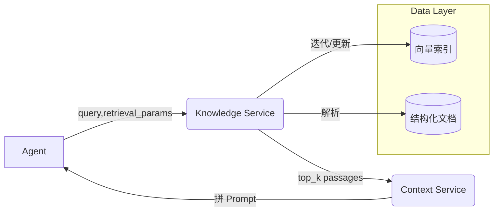

# 专业知识库集成设计

## 1. 场景与挑战
某些 Agent 在执行任务过程中，需要查阅领域知识（法规、产品手册、FAQ、技术标准等）。若把整库内容全部放入 Prompt，既不现实也会导致幻觉风险；因此需建立**知识检索 → 精选注入**的机制。

## 2. 体系架构

> **说明**：
> - Knowledge Service 负责检索/摘要；Context Service 负责将检索结果转成 CONTEXT_DATA 注入 Prompt。

## 3. Knowledge Registry
类似 Tool Registry，为每个知识源维护元数据。
| 字段 | 说明 |
|------|------|
| `source_id` | 唯一 ID，例如 `regulation_cn_gdpr` |
| `title` | 知识源名称 |
| `type` | `static_doc` / `vector_index` / `api` |
| `trust_level` | 1-5，用于排序或过滤 |
| `refresh_cycle` | 更新周期，例如 `daily` |
| `copyright` | 版权信息及可否摘录 |

## 4. Agent → Knowledge 需求声明
在 Agent Registry 新增字段 `knowledge_scope`：
```json
"knowledge_scope": [
  {"domain": "crm_policy", "top_k": 3},
  {"domain": "regulation_cn_gdpr", "top_k": 1}
]
```
- Agent 在 `get_context` 请求中可动态调整 `top_k` 或附带额外检索 query。

## 5. 检索流程
1. **Agent** 提供 `retrieval_query`（当前客户投诉内容等）。
2. **Knowledge Service** 根据 `knowledge_scope` + query → 先用向量索引/关键字搜索。
3. 过滤 `trust_level` ≥ 阈值的文档。
4. 对返回段落进行 **片段摘要**（chunk summary），最大 50-100 tokens/段。
5. 输出 `passages` 列表给 Context Service。

## 6. Prompt 注入策略
在 `CONTEXT_DATA` 中新增 `knowledge_snippets` 字段：
```json
"knowledge_snippets": [
  {
    "source": "crm_policy#42",
    "content": "客户投诉需在 24 小时内第一次响应…",
    "trust": 5
  },
  {
    "source": "regulation_cn_gdpr#12",
    "content": "用户个人数据需经同意后才能存储…",
    "trust": 4
  }
]
```
- 同源多段落可合并摘要。
- `trust`<3 的段落默认不注入，除非 Agent 明示允许。

## 7. 缓存与过期
- Knowledge Service 对相同查询 (+filter) 结果缓存 1-5 分钟。
- 当知识源更新 (`refresh_cycle`) 时，增量重建向量索引。

## 8. 安全合规
- 敏感文档需脱敏后入库；
- 在 Prompt 中引用内容不得超出版权限制；
- 注入片段附带 `source` 便于后期审计与追溯。

## 9. 迭代落地
1. **Sprint-2 扩展**：
   - 搭建向量库（例如 PGVector / Milvus）。
   - 导入常用 FAQ 与政策文件。
2. **Sprint-3**：
   - Agent SDK 支持传递 `retrieval_query`；
   - Knowledge Service REST API `/search` 上线；
   - Context Builder 注入 `knowledge_snippets`。
3. **后续**：
   - 支持 RAG（二次生成摘要）
   - 动态调整 `top_k`，基于 LLM 置信度自调。 