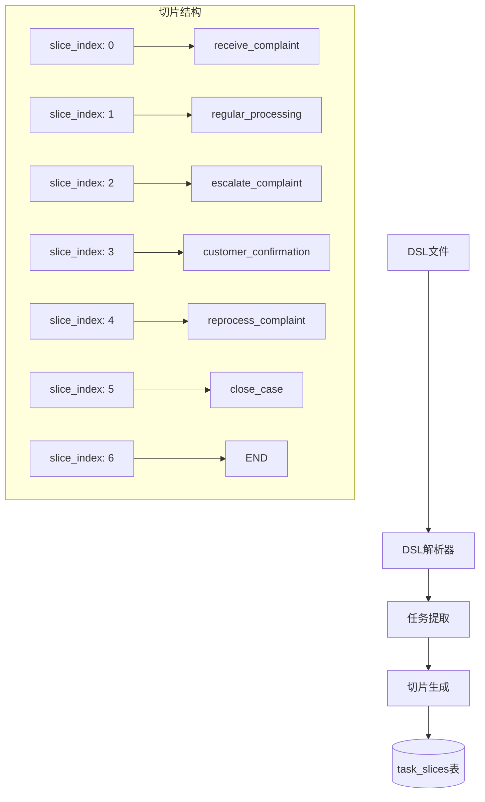
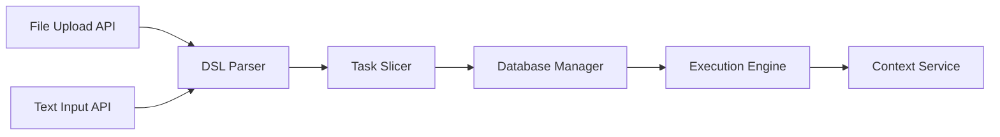

# 任务切片设计方案

## 1. DSL分析与切片策略

### 1.1 DSL结构分析

基于提供的 `level_2_medium_natural_llm_generated_20250715_100809.dsl` 文件，我们识别出以下DSL元素：

```
# 变量定义
@var complaint_severity = ""
@var customer_type = ""

# 任务定义（共7个任务）
@task receive_complaint 接收与评估投诉
@task regular_processing 常规处理  
@task escalate_complaint 升级处理
@task customer_confirmation 客户沟通与确认
@task reprocess_complaint 重新处理
@task close_case 结案归档
@task END 流程结束

# 工具调用
@tool crm_system_create 创建投诉工单
@tool notification_service 发送紧急通知
@tool satisfaction_survey 满意度调查工具
@tool crm_system_update 更新工单状态

# 流程控制
@if...@else 条件分支
@next 任务跳转
```

### 1.2 切片策略选择

#### 方案对比：

| 切片方案 | 优点 | 缺点 | 适用场景 |
|---------|------|------|---------|
| **按@task切片** | 逻辑清晰，符合DSL结构，便于管理 | 单个task可能包含多步骤 | ✅ **推荐方案** |
| 按操作步骤切片 | 更细粒度控制，灵活性高 | 复杂度增加，管理困难 | 复杂流程场景 |
| 按工具调用切片 | 工具执行独立性强 | 破坏任务逻辑连贯性 | 工具密集型场景 |

#### 最终选择：**按@task为单位进行切片**

**理由：**
1. **逻辑完整性**：每个@task代表一个完整的业务步骤
2. **DSL自然结构**：符合DSL的设计意图
3. **便于理解**：开发者和用户都容易理解
4. **易于调试**：任务级别的错误定位更直观

### 1.3 切片映射关系



## 2. 数据库存储设计

### 2.1 任务表结构扩展

在已有的 `task_slices` 表基础上，切片内容的JSON结构设计：

```json
{
  "task_name": "receive_complaint",
  "task_title": "接收与评估投诉", 
  "description": [
    "使用CRM系统创建新的投诉工单",
    "记录客户信息、联系方式和投诉内容",
    "初步设置投诉严重等级：{{complaint_severity}}",
    "查询客户类型：{{customer_type}}"
  ],
  "tools": [
    {
      "name": "crm_system_create",
      "description": "创建投诉工单",
      "position": 2
    }
  ],
  "conditions": [
    {
      "expression": "complaint_severity == \"高\" OR customer_type == \"VIP客户\"",
      "true_next": "escalate_complaint",
      "false_next": "regular_processing"
    }
  ],
  "variables_used": ["complaint_severity", "customer_type"],
  "default_next": null
}
```

### 2.2 全局变量存储

在主任务(tasks表)的payload字段中存储：

```json
{
  "dsl_metadata": {
    "source_file": "level_2_medium_natural_llm_generated_20250715_100809.dsl",
    "generated_at": "2025-07-15T10:08:09.144390",
    "provider": "openai",
    "model": "deepseek-chat-0324"
  },
  "global_variables": {
    "complaint_severity": {
      "type": "string",
      "default": "",
      "description": "投诉严重等级"
    },
    "customer_type": {
      "type": "string", 
      "default": "",
      "description": "客户类型"
    }
  },
  "runtime_variables": {
    "complaint_severity": "高",
    "customer_type": "VIP客户"
  }
}
```

## 3. 接口设计

### 3.1 文件上传接口

```python
POST /api/tasks/upload-dsl
Content-Type: multipart/form-data

{
  "file": <DSL文件>,
  "agent_id": "uuid",
  "metadata": {
    "description": "客户投诉处理流程",
    "version": "1.0",
    "tags": ["customer_service", "complaint"]
  }
}

# 响应
{
  "task_id": "uuid",
  "status": "parsed",
  "slices_count": 7,
  "variables": ["complaint_severity", "customer_type"],
  "message": "DSL解析成功，任务切片已创建"
}
```

### 3.2 文本输入接口

```python
POST /api/tasks/create-from-text
Content-Type: application/json

{
  "dsl_content": "# DSL文本内容...",
  "agent_id": "uuid", 
  "metadata": {
    "description": "直接输入的DSL流程",
    "version": "1.0"
  }
}
```

### 3.3 任务执行接口

```python
POST /api/tasks/{task_id}/execute
Content-Type: application/json

{
  "initial_variables": {
    "complaint_severity": "高",
    "customer_type": "VIP客户"
  },
  "execution_mode": "step_by_step" // 或 "auto"
}
```

## 4. 实现架构

### 4.1 核心组件



### 4.2 模块职责

| 模块 | 职责 | 输入 | 输出 |
|------|------|------|------|
| **DSL Parser** | 解析DSL语法，提取结构化信息 | DSL文本 | AST结构 |
| **Task Slicer** | 将AST转换为数据库切片 | AST结构 | 切片数据 |
| **File Upload Handler** | 处理文件上传和验证 | 文件流 | DSL文本 |
| **Execution Engine** | 执行任务切片，处理流程控制 | 切片+变量 | 执行结果 |

## 5. 实现路径

### 5.1 开发优先级

#### Phase 1: 基础DSL解析 (M3延伸)
- [ ] 创建DSL解析器基础框架
- [ ] 实现@task、@var、@tool等基本语法解析
- [ ] 设计切片数据结构

#### Phase 2: 数据库集成 (M3)
- [ ] 扩展task_slices表的JSON Schema
- [ ] 实现切片CRUD操作
- [ ] 添加变量管理功能

#### Phase 3: API接口 (M5)
- [ ] 实现文件上传接口
- [ ] 实现文本输入接口
- [ ] 集成到Context Service

#### Phase 4: 执行引擎 (M6-M7)
- [ ] 实现条件分支逻辑
- [ ] 实现变量替换机制
- [ ] 集成工具调用

### 5.2 技术栈选择

```python
# DSL解析
- 正则表达式 + 状态机（简单DSL）
- 或者 PLY (Python Lex-Yacc) （复杂DSL）

# 数据验证
- Pydantic模型验证
- JSON Schema验证

# 文件处理
- FastAPI File Upload
- 文件类型验证和大小限制
```

## 6. 错误处理和验证

### 6.1 DSL语法验证

```python
class DSLValidationError(Exception):
    def __init__(self, line_number: int, message: str):
        self.line_number = line_number
        self.message = message

# 验证规则
- @task必须有唯一名称
- @tool引用的工具必须在Tool Registry中存在
- @next引用的任务必须存在
- 变量引用{{var}}必须在@var中定义
- 条件表达式语法正确性
```

### 6.2 运行时验证

```python
# 切片完整性检查
- 所有任务都有可达路径
- 没有孤立的任务节点
- 变量类型匹配
- 工具参数完整性
```

## 7. 示例应用

基于客户投诉流程DSL，系统将创建7个切片：

1. **Slice 0**: receive_complaint - 包含CRM工具调用和条件分支
2. **Slice 1**: regular_processing - 常规处理步骤
3. **Slice 2**: escalate_complaint - 包含notification_service工具
4. **Slice 3**: customer_confirmation - 包含satisfaction_survey工具和条件分支
5. **Slice 4**: reprocess_complaint - 重新处理逻辑
6. **Slice 5**: close_case - 包含crm_system_update工具
7. **Slice 6**: END - 流程结束标记

每个切片都是可独立执行的单元，Context Service将根据执行结果和条件分支决定下一个切片的执行。 