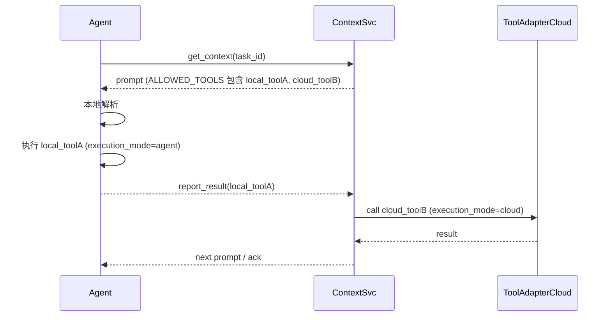

# 工具与 Agent 关系设计

## 1. 为什么要区分执行位置
- **网络拓扑**：有些 API 只在公司内网开放，需要驻扎在业务集群旁的 Agent 调用；云端 Context Service 无法直接访问。
- **延迟 & 带宽**：本地文件系统、摄像头等高 I/O 设备调用必须在 Agent 本地完成，以减少延迟。
- **安全合规**：某些敏感数据（如 PII）不得离开本地机房，只能在 Agent 内部处理。

因此，Tool Registry 必须标注工具的**执行模式**，Agent Registry 也要声明自身能力，Context Service 需在 Prompt 中标示应由谁发起调用。

## 2. Tool Registry 扩展字段
| 字段 | 示例值 | 说明 |
|------|--------|------|
| `execution_mode` | `cloud` / `agent` / `hybrid` | 指定默认执行位置 |
| `agent_runtime` | `python3.10` / `node18` | 若 `execution_mode=agent`，要求的运行时 |
| `network_scope` | `intranet` / `public` | API 可访问范围 |
| `security_level` | `pii` / `general` | 数据合规等级，影响加密传输 |

> **hybrid**：Context Service 发起长流程，步骤中需要 Agent 去执行本地动作，再回云端继续。例如 OCR → 本地拍照，云端模型推理。

## 3. Agent Registry 扩展字段
| 字段 | 示例值 | 说明 |
|------|--------|------|
| `capabilities` | `["python3.10", "gpu", "camera"]` | Agent 支持的本地运行时与硬件 |
| `network_zone` | `dc-beijing` | 所在机房或 VPC 区域 |

## 4. 调度逻辑
1. **Prompt 生成阶段**
   - Context Service 在构造 `ALLOWED_TOOLS` 时，会过滤出 *execution_mode=cloud* 的工具，由 Scheduler 直接在云端 Adapter 调用。
   - 对 *execution_mode=agent* 的工具，仅在 Prompt 中注明名称/参数，实际由 Agent 本地 SDK 解析并执行。
2. **Agent 侧执行**
   - Agent SDK 读取 LLM 返回中的 `{"tool":"X"}` 指令。
   - 若 `Tool.execution_mode = agent` 且 Agent.capabilities 满足，则本地执行；否则返回错误让 Scheduler 回退。
3. **Hybrid 工具**
   - Tool 定义两阶段：`pre` (agent-local)  + `post` (cloud)。Scheduler 会在需要时拆分调用路径。

## 5. 交互时序（示例）


## 6. Prompt 中的标识建议
在 `ALLOWED_TOOLS` 的每一项下新增 `@execution_mode` 注释，供 LLM 明确选择。
```
notification_service (cloud): 向相关部门推送紧急通知
crm_local_export (agent): 导出本地 CRM 文件
```

## 7. 安全与合规
- 对 `execution_mode=agent` 工具，Prompt 不应泄露敏感云端密钥。
- 对 `pii` 级工具，结果上报需加密或仅上传哈希值。

## 8. 落地步骤
1. 更新 Tool Registry Schema，加字段 `execution_mode` 等；
2. Agent Registry 增加 `capabilities`, `network_zone`；
3. Prompt Builder 根据 Tool.execution_mode 决定云端或本地执行；
4. Agent SDK 新增能力检查 & 本地 Tool Adapter；
5. 监控链路区分云端 / 本地调用耗时与成功率。 